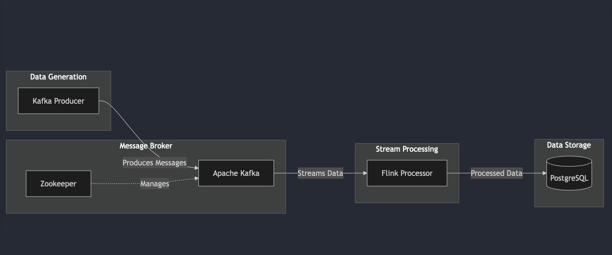

# Kafka-Flink-Postgres Data Streaming Project

This project demonstrates a data streaming pipeline using Apache Kafka, Apache Flink, and PostgreSQL. The pipeline simulates weather data generation, processes it using Flink, and stores the results in a PostgreSQL database.


## Project Structure

- **kafka-producer**: A Python-based Kafka producer that generates and sends weather data to a Kafka topic.
- **flink-processor**: A Java-based Flink application that processes the weather data from Kafka and computes average temperatures.
- **postgres**: A PostgreSQL database to store the processed data.

## Prerequisites

- Docker and Docker Compose
- Maven
- Python 3.8

## Setup and Installation

1. **Build the Project**

   Navigate to the `flink-processor` directory and build the project using Maven:
   ```bash
   cd flink-processor
   mvn clean package   ```

2. **Build Docker Images**

   Build the Docker images for the Kafka producer and Flink processor:
   ```bash
   cd kafka-producer
   docker build -t kafka-producer .

   cd ../flink-processor
   docker build -t flink-processor .   ```

3. **Start the Services**

   Use Docker Compose to start all services:
   ```bash
   docker-compose up --build -d   ```

## Usage

- **Kafka Producer**: Generates weather data every 10 seconds and sends it to the Kafka topic `weather`.

- **Flink Processor**: Consumes data from the Kafka topic, calculates the average temperature for each city every minute, and inserts the results into the PostgreSQL database.

- **PostgreSQL**: Stores the processed data in the `weather` table.

## Accessing the Data

To view the data stored in PostgreSQL, you can use the following command:

bash
docker exec -it postgres psql -U postgres -d postgres


Then, run the SQL query:

```sql
select * from weather;
```


## Configuration

- **Kafka Producer**: Configured in `kafka-producer/python-producer.py` to connect to Kafka and generate data.

- **Flink Processor**: Configured in `flink-processor/src/main/java/Main.java` to process data and connect to PostgreSQL.

- **Docker Compose**: Configured in `docker-compose.yml` to define services and their dependencies.

## Logging

Logging is configured using Log4j2 in `flink-processor/src/main/resources/log4j2.properties`.

## Cleanup

To stop and remove all running containers, use:

bash
docker-compose down
docker rm -f $(docker ps -aq)

## Acknowledgments

- Apache Kafka
- Apache Flink
- PostgreSQL
- Docker

## Output

   

   

   
   
   
   
   

   

   

## Architecture Diagram



## Architecture Workflow


